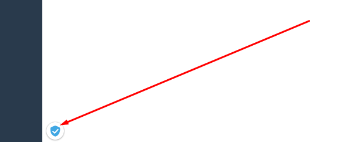
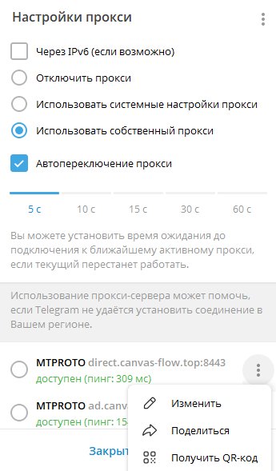
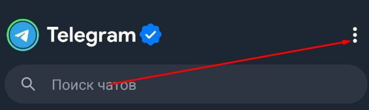
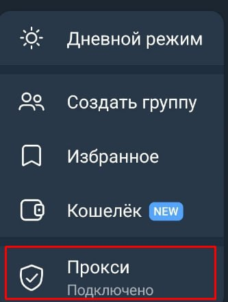
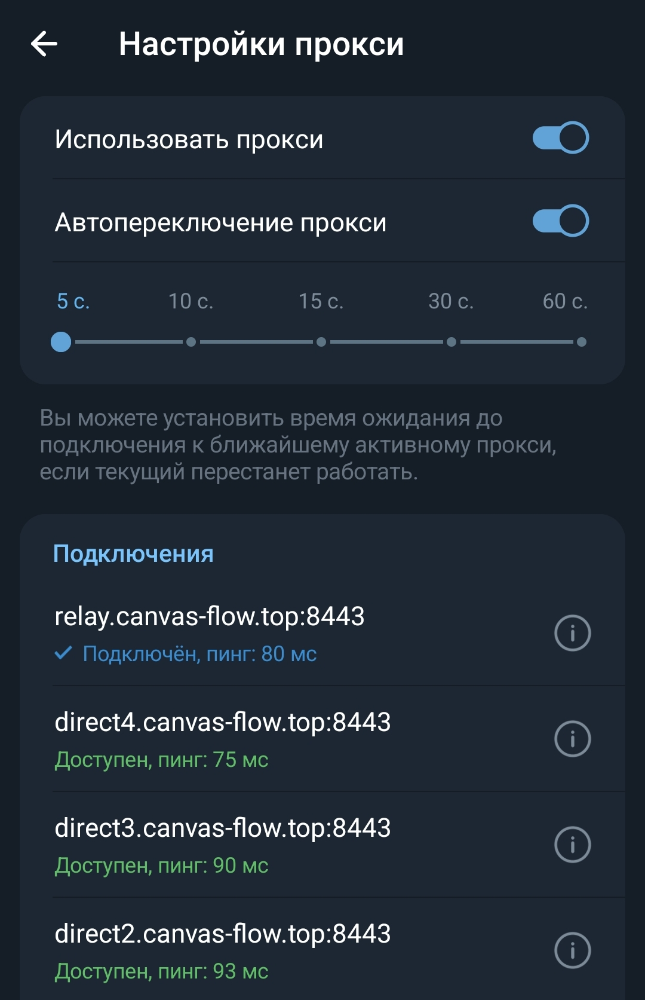
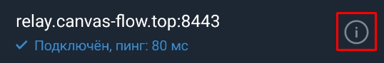

# Подключение

### Я оплатил, куда нажимать дальше, чтобы VPN заработал? {: #first-connection }

1. Нажмите постоянную кнопку «Меню» под полем ввода сообщения.
2. Нажмите «VPN» — бот покажет персональную ссылку и краткую инструкцию.
3. Скопируйте ссылку в приложение или нажмите «Подключить». Подробные инструкции со скриншотами доступны по кнопке
   «Инструкции» в этом же разделе бота.

---

### Какую локацию для подключения выбрать?
**Белые списки** — позволяет обходить региональные ограничения, когда не открывается ничего кроме ВК и Яндекса. _Трафик покупается отдельно._

**Лучшая локация** — приоритетный выбор, выбирает лучшую локацию из связок «РФ -> Зарубежная страна». Выбирайте это, если не нужна конкретная зарубежная страна.

**РФ -> Зарубежная страна** — российские сайты открываются при включённом VPN, YouTube без рекламы.

**Зарубежная страна** — обычный впн, прямое подключение к зарубежной стране. Может быть стабильнее для игр.

---

### Какое приложение для подключения использовать?
Подойдёт любой современный V2Ray-клиент, умеющий передавать HWID (ID устройства).

Например, Happ или incy. Ссылки на скачивание здесь: [Кликните](general.md#apps)

---

### Как обновить список локаций?

Локации в приложении обновляются автоматически раз в час. Чтобы получить изменения сразу, нажмите кнопку обновления
подписки в Happ, incy или другом используемом приложении и немного подождите.

---

### Как подключить VPN на новом устройстве?

Скопируйте вашу ссылку на VPN из бота и добавьте её в приложение на новом устройстве либо воспользуйтесь QR-кодом.
Устройство добавится автоматически. Неиспользуемые устройства можно удалить через меню бота. Вы можете делиться
доступом с близкими в рамках вашего лимита.

Подробнее о лимите устройств тут: [Кликните](general.md#limit-devices)

---

### Как подключить VPN по QR-коду?

Откройте «Меню» → «VPN» → «QR-код». На новом устройстве откройте функцию сканирования QR-кода в приложении для
подключения и отсканируйте код с экрана первого устройства.

!!! warning "QR-код содержит персональную ссылку"
    Не публикуйте QR-код и не отправляйте его посторонним. Человек, получивший код, сможет использовать Ваш доступ в
    пределах установленного лимита устройств.

---

### Когда нужно обновлять ссылку на VPN?

Используйте «Меню» → «VPN» → «Обновить ссылку», если ссылка попала к постороннему или Вы хотите отозвать доступ на всех
ранее настроенных устройствах. После подтверждения старая ссылка и добавленные по ней конфигурации перестанут работать.
Новую ссылку потребуется заново добавить на все нужные устройства.

!!! danger "Операцию нельзя отменить"
    Не обновляйте ссылку без необходимости: восстановить старую ссылку после подтверждения не получится.

---

### Как подключить Телеграм-прокси на новом устройстве? {: #share-tg-proxy }

1. Убедитесь, что в боте активны дни доступа, и откройте «Меню» → «Прокси».
2. Нажмите «WEB-прокси» для нового формата или «Подключить» для обычного прокси.
3. Подтвердите добавление и включение прокси в Telegram. Достаточно один раз добавить и включить работающий вариант;
   другие предложенные прокси можно добавить как запасные.

Если Telegram не открывает кнопку «WEB-прокси», обновите приложение до версии с поддержкой WEB-прокси. Пока этот
формат недоступен в Вашем клиенте, используйте обычный прокси или VPN.

Для другого устройства можно воспользоваться ссылкой из бота или поделиться уже добавленным прокси через настройки
Telegram. Расположение кнопок зависит от версии приложения; примеры показаны на скриншотах ниже.

Для звонков в Telegram и обхода белых списков используйте VPN. Трафик белых списков покупается отдельно.

Если ссылка на прокси попала к посторонним, выберите в боте «Меню» → «Прокси» → «Обновить ссылку» или «Обновить ссылки».
После подтверждения обновятся ссылки обоих форматов — обычного и WEB. Старые ссылки перестанут работать, а новые
потребуется подключить заново на всех нужных устройствах.

??? Info "Нажмите, чтобы посмотреть фото"
    ??? Success "Нажмите, если интересует компьютер"
        <b>Найдите кнопку в левом нижнем углу и нажмите на неё.</b>

        

        <b>Откроется список прокси, где есть все необходимые кнопки.</b>

        

    ??? Success "Нажмите, если интересует телефон"
        <b>Найдите три точки справа сверху над списком чатов (если у вас кастомная тема в Телеграм, они могут быть плохо видны, но они там есть).</b>

        
        
        <b>Нажмите на кнопку "Прокси".</b>

        
    
        <b>Откроется меню со списком прокси.</b>
    
        { width="50%" }
        
        <b>Нажмите на кнопку справа от названия прокси, чтобы увидеть кнопку "Поделиться".</b>

        

---

### Настройка на роутере
Мы не предоставляем поддержку роутеров. При самостоятельной настройке убедитесь, что ваша программа для подключения передает HWID (ID устройства), иначе подключить не получится.

---

### Режимы Proxy и TUN на компьютере
Для браузеров рекомендуется стабильный режим **Proxy**. Режим **TUN** нужен только тогда, когда необходимо принудительно завернуть весь трафик системы в VPN. Discord также запускается именно при активном режиме **TUN**. Если режим **TUN** не работает, запустите программу от имени администратора. 

При выборе режима **TUN** выбирайте **Sing-box**, если такая настройка есть.
