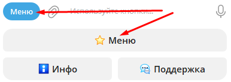
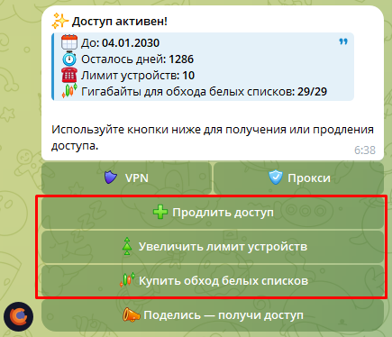

# Общие вопросы

### Что входит в стоимость ежемесячного доступа?

Вы получаете безлимитный доступ к VPN и Телеграм-прокси. Трафик для обхода региональных ограничений «белых списков» (так
называемых глушилок) оплачивается дополнительно по желанию (1 ГБ = 4 рубля).

---

### Какие устройства поддерживаются?

Сервис работает на смартфонах и планшетах (Android, iOS), компьютерах и ноутбуках (Windows 10-11, macOS, Linux), а также
телевизорах (Android TV, Apple TV). Устаревшие ОС (например, Windows 7 или 8.1) не поддерживаются.

---

### Какие страны у вас есть?

Список актуальных локаций можно посмотреть в Телеграм боте. Для этого нужно нажать кнопки: Инфо → Статус серверов. Вы
увидите актуальный список зарубежных локаций и их загруженность.

---

### Насколько быстрая скорость?

Мы гарантируем скорость около 1 ГБит/c. Скорость на локациях для работы с Торрентами может быть ниже.

---

### Есть ли бесплатный пробный период?

Да, вы можете получить 3 дня бесплатного доступа. В боте нажмите «Получить доступ» → «Бесплатный доступ», подпишитесь на
новостной канал и подтвердите действие. Бесплатный период можно активировать только один раз, затем кнопка пропадёт.

---

### Бот отправляет уведомления?
Бот отправляет уведомления только об окончании дней доступа: за 12 часов, 1 час, об окончании.

Также мы можем отправить текстовое сообщение через бота, если необходимо сообщить что-то очень важное, но это бывает редко. Для публикации новостей у нас есть канал.

---

### Как продлить доступ \ купить доп. устройства или трафик белых списков?
??? Info "Нажмите, чтобы посмотреть фото"
    <b>Войдите в меню.</b>

    

    <b>Затем используйте соответствующие кнопки.</b>
    
    

---

### Есть ли ограничения по трафику?

Для обычного VPN и Телеграм-прокси трафик полностью безлимитный. Ограничение трафика действует только для локаций «Белые
списки», для которых трафик покупается отдельно.

---

### На скольких устройствах можно использовать VPN и Телеграм-прокси? {: #limit-devices }

По умолчанию вы получаете доступ на 3 устройствах. Лимит можно увеличить за дополнительную плату через меню бота. Это
разовая покупка, лимит устройств увеличивается навсегда.
!!! warning "Лимит устройств для Телеграм-прокси"
    В случае Телеграм-прокси нигде не будет написано, что вы достигли лимита устройств, но если вы будете пытаться
    подключиться сверх лимита, соединение разорвётся. Таким образом, если вам кажется, что Вашим прокси пользуется слишком
    много человек, Вы можете обновить ссылку с помощью кнопок в боте.

---

### С помощью чего можно оплачивать?

Оплатить можно с помощью СБП, российской карты, криптовалюты или Telegram Stars.

---

### Как долго обрабатывается платёж? {: #payment-problem}

Обработка платежа может занимать до 5 минут. В редких случаях до 10 минут.
!!! Danger "Я жду больше 10 минут, но ничего не происходит!"
    Если средства списались, свяжитесь с поддержкой, кликнув в боте на кнопку "Поддержка". Если средства на месте — оплата
    не прошла по причинам, которые от нас не зависят (возможно, что-то связано с вашим банком), и мы не сможем на это
    повлиять.

---

### Есть ли автосписания?

Нет. Деньги без вашего прямого участия не списываются, оплата происходит только вручную.

---

### Можно ли сделать возврат средств?

Если у вас возникли нерешаемые технические сложности, которые не позволяют использовать наш сервис, мы оформим возврат.
Деньги возвращаются в течение 1-3 дней туда, откуда была произведена оплата.

!!! Success "Хочу оформить возврат!"
    Для оформления возврата свяжитесь с поддержкой, кликнув в боте на кнопку "Поддержка".