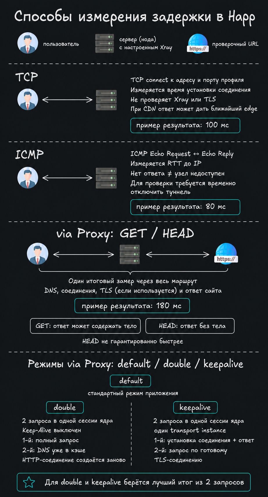

# Общие вопросы

### Что входит в стоимость ежемесячного доступа?

Вы получаете безлимитный доступ к VPN и Телеграм-прокси. Трафик для обхода региональных ограничений «белых списков» (так
называемых глушилок) оплачивается дополнительно по желанию. Актуальные пакеты и цены смотрите непосредственно в боте.

---

### Сколько стоит доступ и на какой срок его можно купить?

В боте доступны быстрые варианты на 30, 90, 180 и 365 дней. Кнопка «Ввести своё число» позволяет выбрать любой срок от
30 до 3650 дней. Актуальные цены смотрите непосредственно в боте: точная сумма с учётом скидки за объём отображается до
перехода к оплате.

---

### Какие устройства поддерживаются?

Сервис работает на смартфонах и планшетах (Android, iOS), компьютерах и ноутбуках (Windows 10-11, macOS, Linux), а также
телевизорах (Android TV, Apple TV). Устаревшие ОС (например, Windows 7 или 8.1) не поддерживаются.

---

### Какие приложения можно использовать для подключения? {: #apps }

Для подключения мы рекомендуем использовать приложения incy или Happ. Выберите ваше устройство, кликнув на кнопку ниже.

??? Info "Android / Android TV"
    - incy: [Кликните](https://play.google.com/store/apps/details?id=llc.itdev.incy)
    - Happ: [Кликните](https://play.google.com/store/apps/details?id=com.happproxy)

    ??? Warning "Huawei (установка напрямую из APK, без GBox)"
        - Happ: [Кликните](https://github.com/Happ-proxy/happ-android/releases/latest/download/Happ.apk)
        - incy: [Кликните](https://github.com/INCY-DEV/incy-platforms/releases/latest/download/Incy.apk)

        На устройствах Huawei устанавливайте приложение непосредственно из скачанного APK-файла. Версия, установленная
        или запущенная через GBox, для подключения не подходит.

??? Info "iOS / macOS / AppleTV"
    ??? Danger "Регион аккаунта РФ"
        - incy: [Кликните](https://apps.apple.com/ru/app/incy/id6756943388)

    ??? Success "Регион аккаунта не РФ"
        - incy: [Кликните](https://apps.apple.com/us/app/incy/id6756943388)
        - Happ: [Кликните](https://apps.apple.com/us/app/happ-proxy-utility/id6504287215)

??? Info "Windows"
    - incy: [Кликните](https://github.com/INCY-DEV/incy-platforms/releases/latest/download/incy-windows-setup.exe)
    - Happ: [Кликните](https://github.com/Happ-proxy/happ-desktop/releases/latest/download/setup-Happ.x64.exe)

??? Info "Linux"
    - incy: [Кликните](https://github.com/INCY-DEV/incy-platforms/releases/latest)
    - Happ: [Кликните](https://github.com/Happ-proxy/happ-desktop/releases/latest)

    На странице релиза выберите пакет для своего дистрибутива и архитектуры процессора.

---

### Как работает пинг в Happ? {: #happ-ping }

Для выбора локации используйте **via Proxy → HEAD** с режимом **keepalive**. Повторите проверку несколько раз и выберите
локацию с наименьшим стабильным пингом.

**Упрощённая схема**

??? Info "Нажмите, чтобы посмотреть фото"
    { width="70%" }

**Технически точная схема**

??? Info "Нажмите, чтобы посмотреть фото"
    { width="70%" }

---

### Можно скачивать и раздавать торренты?
Для скачивания и раздачи торрентов предоставляется отдельная локация, на остальных локациях подобные соединения разрываются в связи с соблюдением европейскими странами законов об авторском праве.

---

### Какие страны у вас есть?

Список актуальных локаций можно посмотреть в Телеграм боте. Для этого нужно нажать кнопки: Инфо → Статус серверов. Вы
увидите актуальный список зарубежных локаций и их загруженность.

---

### Насколько быстрая скорость?

Максимальная заявленная скорость — до 1 Гбит/с. Фактическая скорость зависит от вашего интернет-подключения, устройства,
выбранной локации и текущей нагрузки. На локациях для работы с торрентами скорость может быть ниже.

---

### Есть ли бесплатный пробный период?

Да, вы можете получить 3 дня бесплатного доступа. В боте нажмите «Получить доступ» → «Бесплатный доступ», подпишитесь на
новостной канал и подтвердите действие. Бесплатный период можно активировать только один раз, затем кнопка пропадёт.

---

### Бот отправляет уведомления?

Да. После получения дней доступа откройте постоянную кнопку «Уведомления» под полем ввода сообщения. Там можно отдельно:

* включить или выключить уведомления об окончании доступа — за 12 часов, за 1 час и после окончания;
* включить уведомление об остатке гигабайтов и задать целочисленный порог от 0 до 10 000 ГБ, при достижении которого бот
  напишет Вам.

Также мы можем отправить текстовое сообщение через бота, если необходимо сообщить что-то очень важное, но это бывает редко. Для публикации новостей у нас есть канал.

---

### Как продлить доступ \ купить доп. устройства или трафик белых списков?

Нажмите постоянную кнопку «Меню» под полем ввода сообщения, затем выберите нужное действие: «Продлить доступ»,
«Увеличить лимит устройств» или «Купить обход белых списков». Дополнительные услуги доступны при активном доступе.

---

### Есть ли ограничения по трафику?

Для обычного VPN и Телеграм-прокси трафик полностью безлимитный. Ограничение трафика действует только для локаций «Белые
списки», на которых трафик покупается отдельно.

---

### На скольких устройствах можно использовать VPN и Телеграм-прокси? {: #limit-devices }

По умолчанию вы получаете доступ на 3 устройствах. Лимит можно увеличить за дополнительную плату через меню бота. Это
разовая покупка, лимит устройств увеличивается навсегда.

Максимальный лимит — 24 устройства. В боте есть быстрые варианты на 6, 9, 12 и 24 устройства, а также ввод своего числа.
При увеличении оплачиваются только новые места. Актуальную стоимость бот покажет перед оплатой.

!!! warning "Лимит устройств для Телеграм-прокси"
    В случае Телеграм-прокси нигде не будет написано, что вы достигли лимита устройств, но если вы будете пытаться
    подключиться сверх лимита, соединение разорвётся. Таким образом, если вам кажется, что Вашим прокси пользуется слишком
    много человек, Вы можете обновить ссылку с помощью кнопок в боте.

---

### С помощью чего можно оплачивать?

Оплатить можно с помощью СБП, российской карты, криптовалюты или Telegram Stars.

!!! info "Оплата в Telegram Stars"
    Итоговая цена в Stars выше из-за комиссий Telegram. Точное количество Stars бот покажет до перехода к оплате.
    Оплачивайте счёт с того же Telegram-аккаунта, в котором он был создан, иначе платёж будет отклонён.

---

### Как долго обрабатывается платёж? {: #payment-problem}

Обработка платежа может занимать до 5 минут. В редких случаях до 10 минут.
!!! Danger "Я жду больше 10 минут, но ничего не происходит!"
    Если средства списались, свяжитесь с поддержкой, кликнув в боте на кнопку "Поддержка". Если средства на месте — оплата
    не прошла по причинам, которые от нас не зависят (возможно, что-то связано с вашим банком), и мы не сможем на это
    повлиять.

---

### Есть ли автосписания?

Нет. Деньги без вашего прямого участия не списываются, оплата происходит только вручную.

---

### Как работает реферальная программа?

После получения доступа в меню появится кнопка «Поделись — получи доступ». По ней можно получить персональную ссылку и
отправить её другу. Если друг раньше не запускал бота и по Вашей ссылке впервые купит не менее 30 дней доступа, бот
начислит по 7 дополнительных дней и Вам, и другу.

---

### Можно ли сделать возврат средств?

Если у вас возникли нерешаемые технические сложности, которые не позволяют использовать наш сервис, мы оформим возврат.
Деньги возвращаются в течение 1-3 дней туда, откуда была произведена оплата.

!!! Success "Хочу оформить возврат!"
    Для оформления возврата свяжитесь с поддержкой, кликнув в боте на кнопку "Поддержка".

---

### Где ознакомиться с юридическими документами?

Оплачивая услуги в боте, Вы соглашаетесь с [Пользовательским соглашением](https://telegra.ph/Polzovatelskoe-soglashenie-Canvas-Proxy-04-25)
и [Политикой конфиденциальности](https://telegra.ph/Politika-konfidencialnosti-Canvas-Proxy-04-25).
