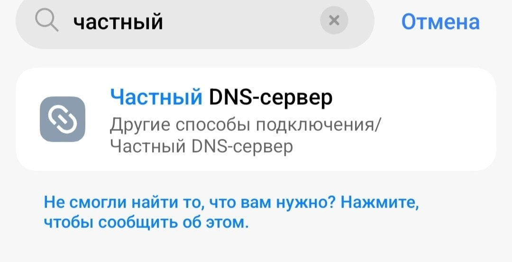
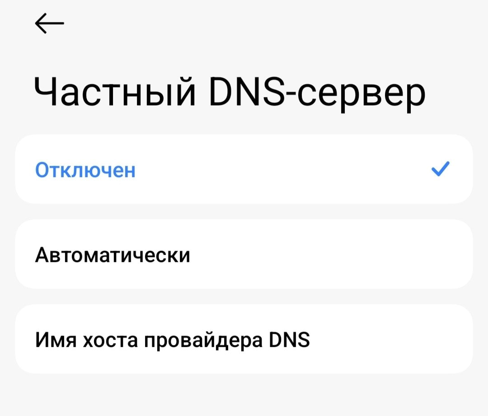
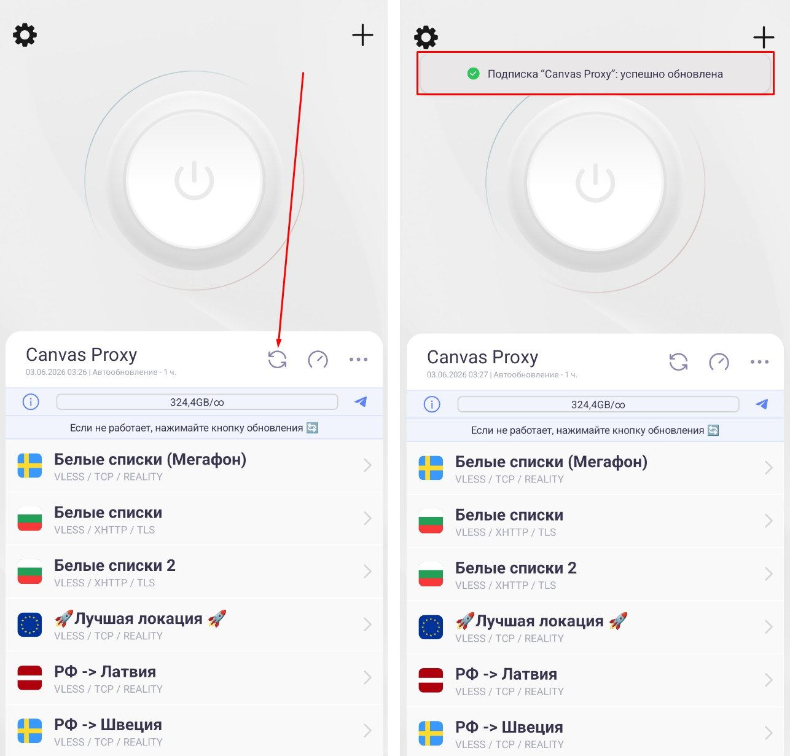
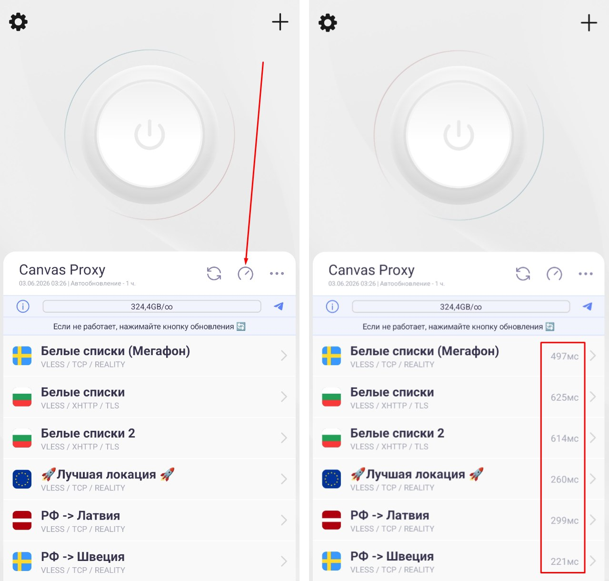
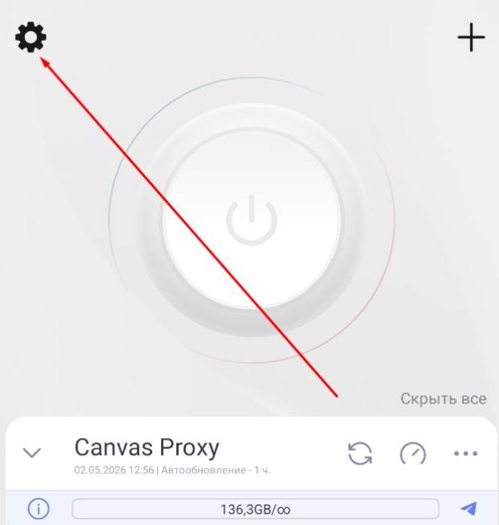
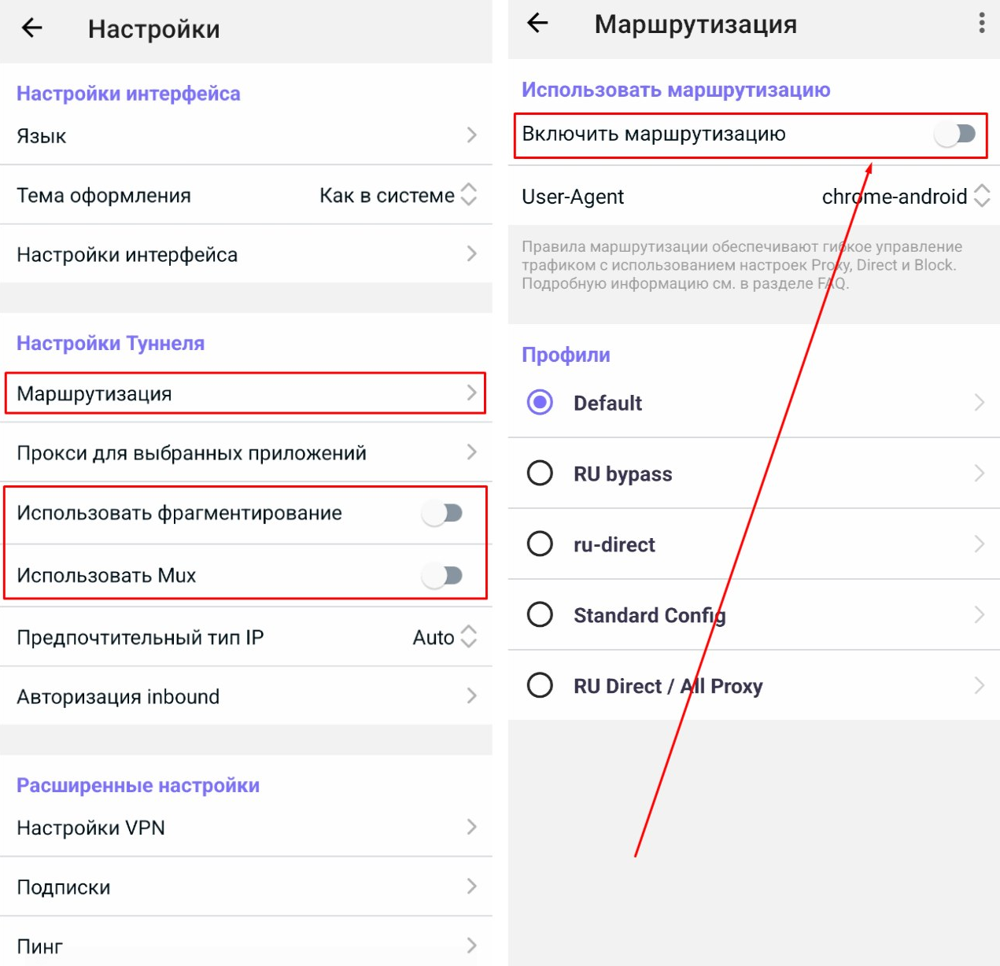
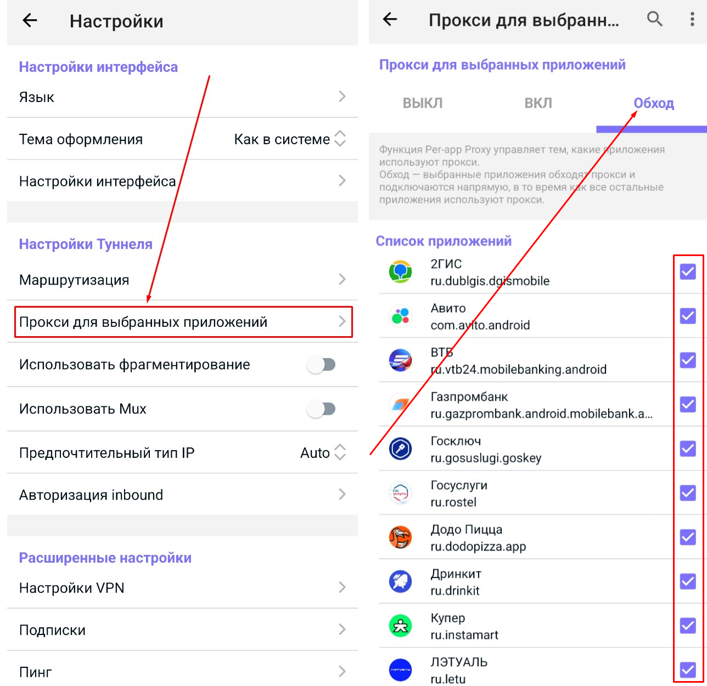

# Решение проблем

### Не добавляется ссылка в приложение (нет локаций для подключения)

1. Установите актуальную версию программы, через которую выполняется подключение (Happ, V2RayTun, incy и др.)
2. Если у вас Android, проверьте в настройках, выключен ли частный DNS-сервер.
    
    ??? Info "Нажмите, чтобы посмотреть фото"
        <b>Найдите этот пункт в настройках телефона. Обычно его можно найти через поиск.</b>
        { width="50%" }
        { width="50%" }

3. Отключите другие VPN-приложения.
4. Смените сеть (с мобильного интернета на Wi-Fi или наоборот).
5. Попробуйте альтернативное приложение (например, v2RayTun вместо Happ).

---

### VPN подключён, но не работает (или все локации н/д) {: #vpn-not-working }

1. Установите актуальную версию программы, через которую выполняется подключение (Happ, V2RayTun, incy и др.)
2. Нажмите кнопку обновления в приложении.
    
    ??? Info "Нажмите, чтобы посмотреть фото"
        { width="70%" }

3. Проверьте пинг в приложении. Подключайтесь к серверу, где появились числа.

    ??? Info "Нажмите, чтобы посмотреть фото"
        <b>На скриншоте приложение Happ, но аналогичным образом пинг проверяется и в других приложениях для подключения.</b>
        { width="70%" }

4. Если у вас Android, проверьте в настройках, выключен ли частный DNS-сервер.
    
    ??? Info "Нажмите, чтобы посмотреть фото"
        <b>Найдите этот пункт в настройках телефона. Обычно его можно найти через поиск.</b> 
        { width="50%" }
        { width="50%" }

5. Проверьте доступность интернета без VPN. Если не загружается, например, Google, значит, в вашем регионе действуют "белые списки" — вам понадобится соответствующая локация, доступ к которой приобретается отдельно. О том, что такое белые списки, читайте здесь: [Кликните](whitelist.md/#about-whitelist)
6. Если используете Happ, проверьте настройки приложения и отключите лишние ползунки (или используйте другое приложение, например, v2RayTun).

    ??? Info "Нажмите, чтобы посмотреть фото"
        { width="40%" }

        { width="50%" }

7. Отключите сторонние программы для обхода блокировок (GoodbyeDPI/zapret), если они есть. Они могут конфликтовать с VPN.
8. Попробуйте альтернативное приложение (например, v2RayTun вместо Happ).

---

### Высокий пинг в приложении

Рекомендуется нажать кнопку проверки пинга пару раз, чтобы получить более точные значения. Высокий пинг в Happ — это
нормальное поведение. Он использует тип проверки "via proxy", который замеряет полное время ответа. Это
не влияет на скорость соединения. Пинг в играх в играх считается иначе, его значения будут более привычными (20-90 мс).
Это можно проверить, изменив тип проверки пинга в настройках приложения (например, на TCP-пинг).

---

### Российские <u>приложения</u> просят выключить VPN

Настройте обход, как показано на скриншоте. В примере приложение Happ, но похожим образом всё настраивается и в других подобных приложениях.
??? Info "Нажмите, чтобы посмотреть фото"
    { width="40%" }
    { width="70%" }

---

### Российские <u>сайты</u> просят выключить VPN / YouTube показывает рекламу

Подключайтесь к локации "Лучшая локация" или "РФ → Зарубеж", чтобы это исправить.

---

### Не хватает стабильности в играх

Попробуйте подключиться к <u>европейской</u> локации напрямую (не "РФ → Зарубеж", не "Лучшая локация").

---

### Не работает конкретный сервис (Gemini, ChatGPT, YouTube, Telegram).

Причины проблем с доступностью могут быть разные. Обычно помогает смена локации и перезапуск нужного приложения/сайта.

---

### Плохо работает Телеграм-прокси

На данный момент Телеграм-прокси могут работать недостаточно хорошо. Проблема не с нашей стороны, а со стороны Телеграм. Важную часть маскировки выполняет само приложение. Если вы это читаете, скорее всего, команда Телеграм до сих пор не исправила проблему.

Тем не менее мы постарались сделать всё возможное для стабильной работы. Возможно, вам помогут следующие советы: 

* Если вы делились ссылкой на прокси с друзьями и вам кажется, что он "пошёл по рукам" и, как следствие, вы вышли за пределы лимита устройств, обновите ссылку на прокси с помощью кнопок в боте.
* Покликайте по прокси в списке вручную, чтобы обновить статус доступности.
* Включите настройку «Автопереключение прокси». Скриншоты, как это сделать: [Кликните](connection.md/#share-tg-proxy)
* Используйте прокси со словом **relay** в названии.
* Если прокси всё равно работает плохо, от него придётся отказаться и использовать VPN.

---

### Проблемы с оплатой
Решение проблем с оплатой описано здесь: [Кликните](general.md/#payment-problem)
