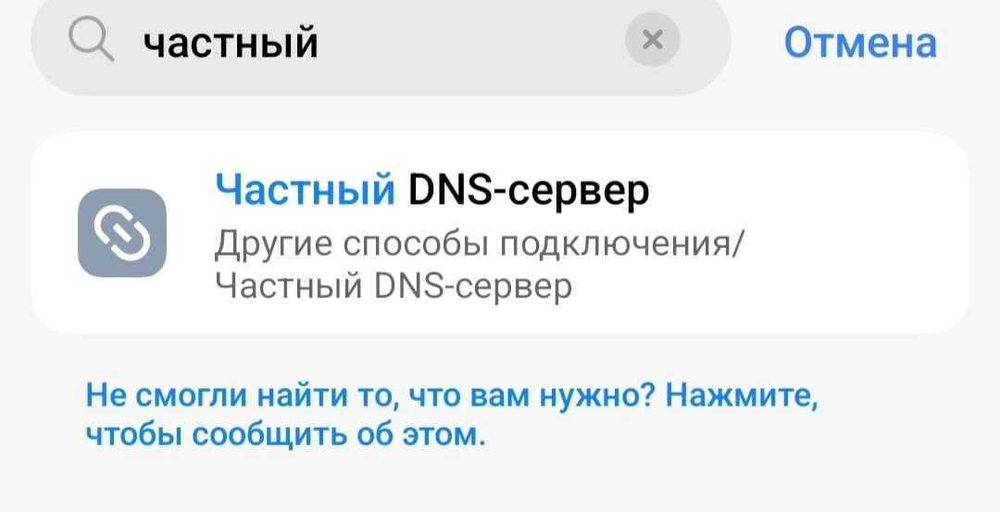
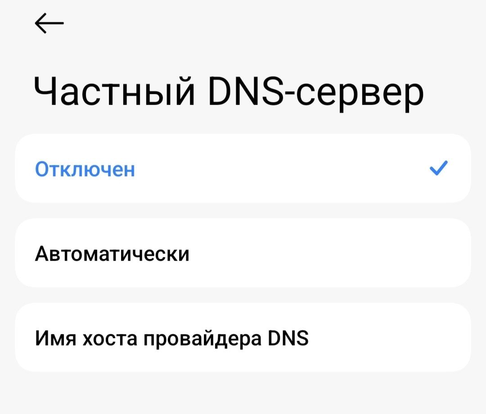
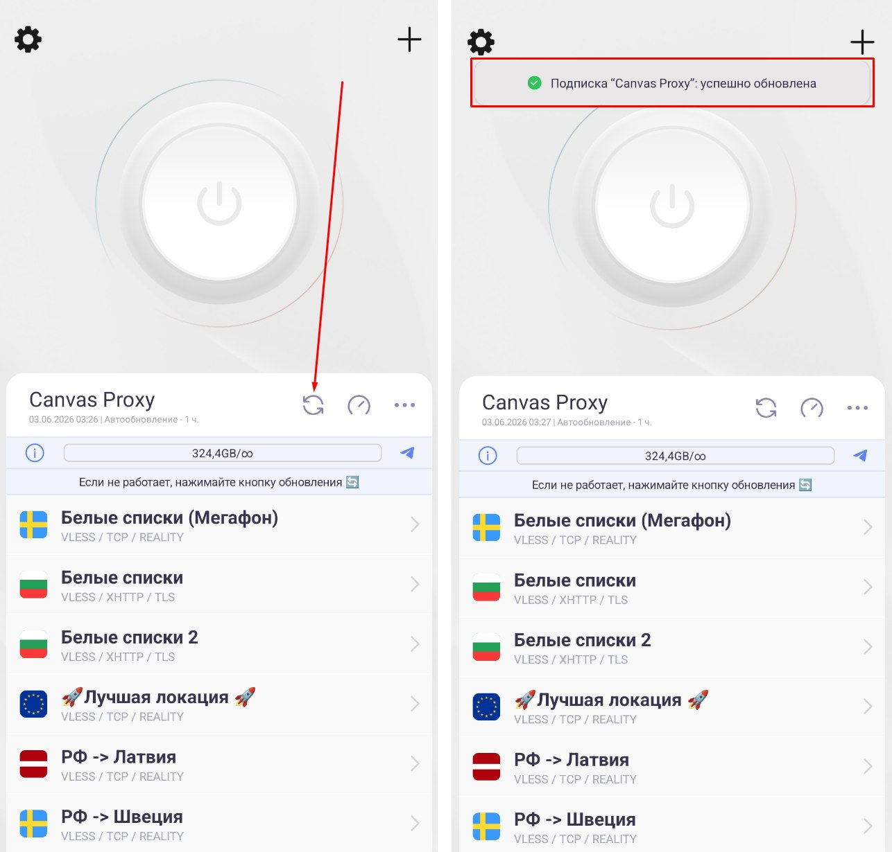
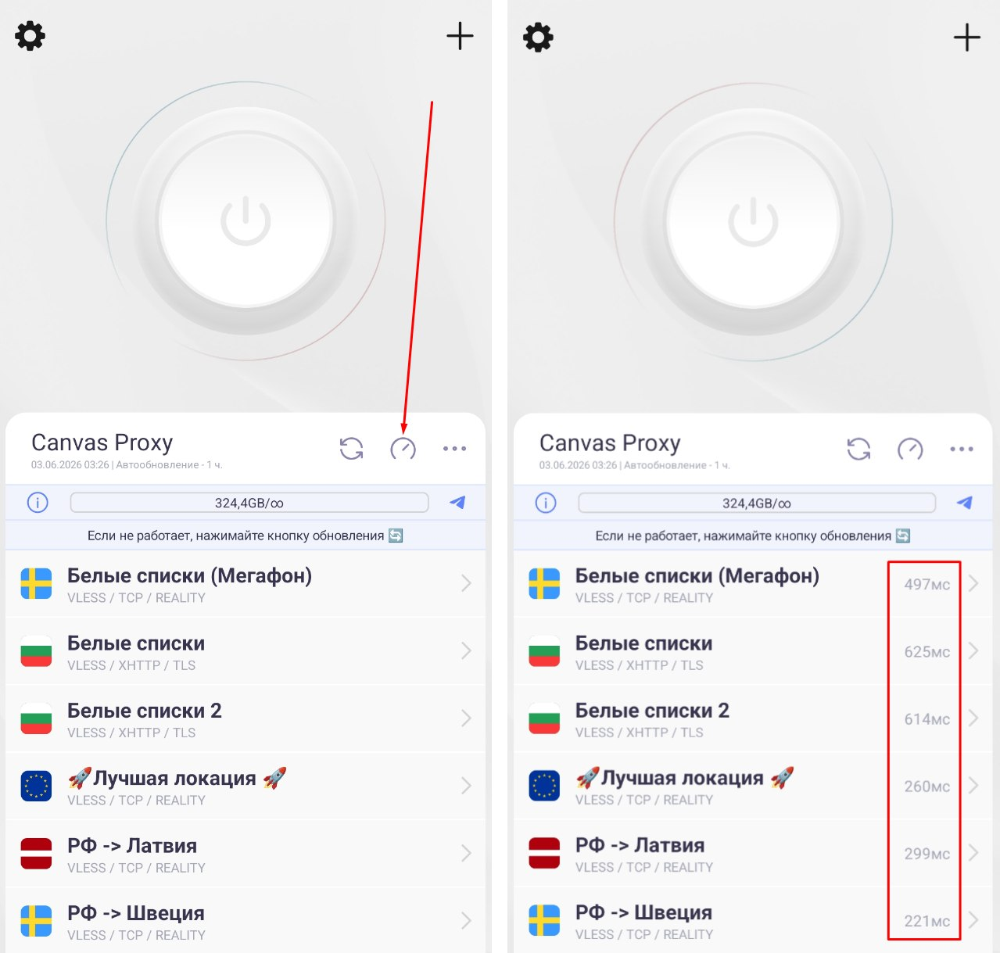
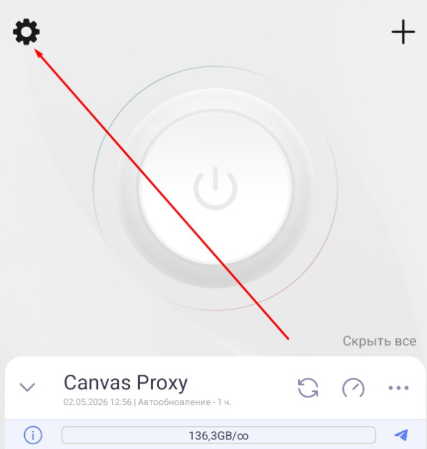
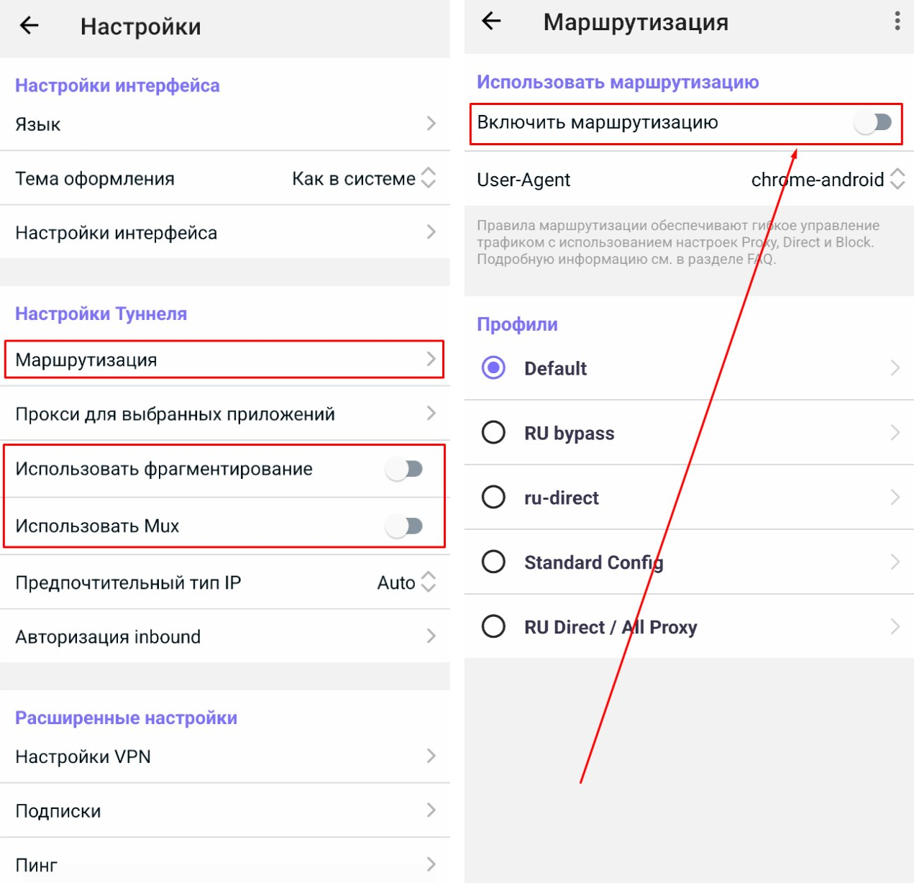
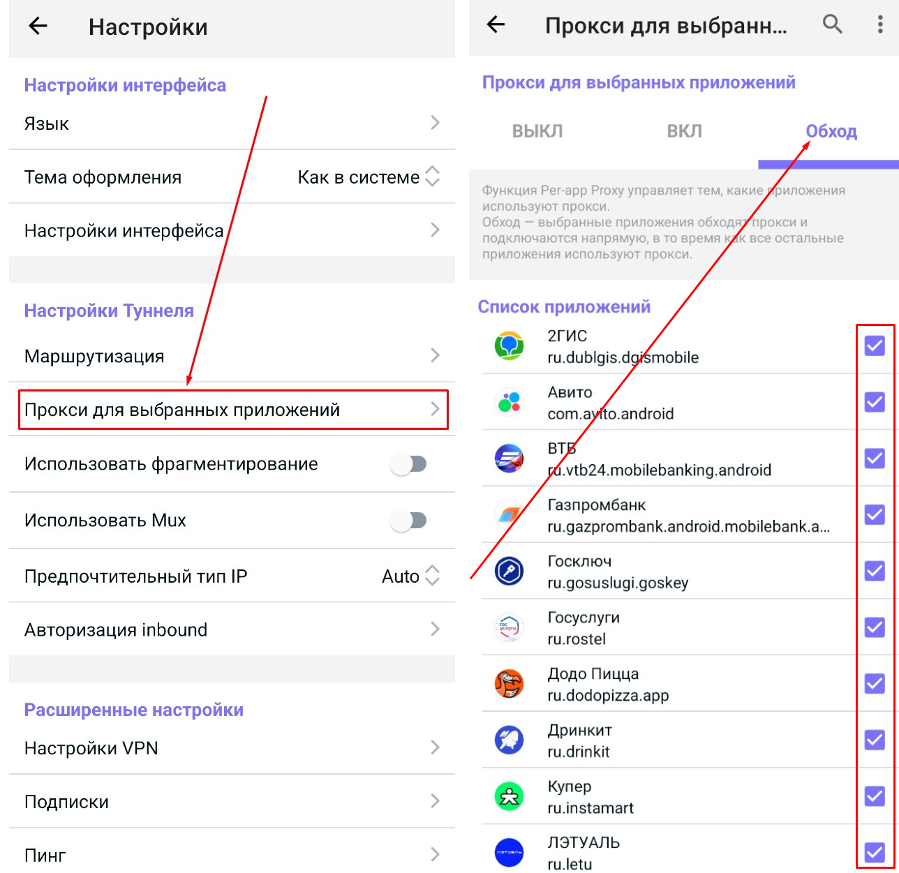
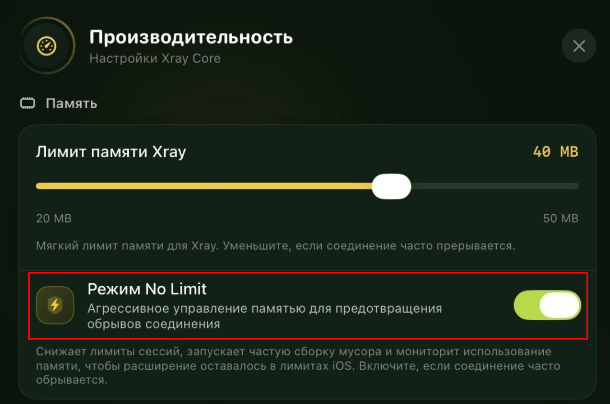

# Решение проблем

### Не добавляется ссылка в приложение (нет локаций для подключения) / Не обновляется по кнопке

1. Установите актуальную версию программы, через которую выполняется подключение (Happ, incy и др.)
2. Отключите другие VPN-приложения (если обновляете ссылку, есть смысл выключить VPN и в активном приложении)
3. Смените сеть (с мобильного интернета на Wi-Fi или наоборот).
4. Если у вас Android, проверьте в настройках, выключен ли частный DNS-сервер.
    
    ??? Info "Нажмите, чтобы посмотреть фото"
        <b>Найдите этот пункт в настройках телефона. Обычно его можно найти через поиск.</b>
        { width="50%" }
        { width="50%" }

5. Попробуйте альтернативное приложение (например, incy вместо Happ).
6. Полностью удалите приложение, установите его заново и повторно добавьте персональную ссылку из бота.

---

### VPN подключён, но не работает (или все локации н/д) {: #vpn-not-working }
1. Проверьте, не используете ли вы программы типа Torrent (или иные, которые могут скачивать или раздавать файлы по протоколу BitTorrent). Для скачивания и раздачи торрентов предоставляется отдельная локация, на остальных локациях подобные соединения разрываются в связи с соблюдением европейскими странами законов об авторском праве. 
2. Установите актуальную версию программы, через которую выполняется подключение (Happ, incy и др.)
3. Нажмите кнопку обновления в приложении.
    
    ??? Info "Нажмите, чтобы посмотреть фото"
        { width="70%" }

4. Проверьте пинг в приложении. Подключайтесь к серверу, где появились числа.

    ??? Info "Нажмите, чтобы посмотреть фото"
        <b>На скриншоте приложение Happ, но аналогичным образом пинг проверяется и в других приложениях для подключения.</b>
        { width="70%" }

5. Если у вас Android, проверьте в настройках, выключен ли частный DNS-сервер.
    
    ??? Info "Нажмите, чтобы посмотреть фото"
        <b>Найдите этот пункт в настройках телефона. Обычно его можно найти через поиск.</b> 
        { width="50%" }
        { width="50%" }

6. Проверьте доступность интернета без VPN. Если не загружается, например, Google, значит, в вашем регионе действуют "белые списки" — вам понадобится соответствующая локация, доступ к которой приобретается отдельно. О том, что такое белые списки, читайте здесь: [Кликните](whitelist.md#about-whitelist)
7. Проверьте скорость своего интернета без VPN. Возможно, он медленный сам по себе: [Кликните](https://yandex.ru/internet/)
8. Если используете Happ, проверьте настройки приложения и отключите лишние ползунки (или используйте другое приложение, например, incy). Если принципиально использование Happ, используйте кнопку сброса в настройках приложения (нужно будет заново добавлять ссылки).

    ??? Info "Нажмите, чтобы посмотреть фото"
        { width="40%" }

        { width="50%" }

9. Отключите сторонние программы для обхода блокировок (GoodbyeDPI/zapret), если они есть. Они могут конфликтовать с VPN.
10. Попробуйте альтернативное приложение (например, incy вместо Happ).
11. Если ничего не помогло, полностью удалите приложение, установите его заново и повторно добавьте персональную ссылку
    из бота.

---

### В Happ нет «Лучшей локации» и пометки JSON {: #happ-user-agent }

Если в Happ одновременно отсутствуют локация **«Лучшая локация»** и пометка **JSON**, причина обычно в заданном вручную
значении **User-Agent**.

1. Откройте **Happ → Настройки → Подписки** и выберите нужную подписку.
2. Полностью очистите поле **User-Agent**: оно должно быть пустым, без пробелов и других значений.
3. Сохраните изменения, затем обновите подписку и список локаций.

Если это не помогло, сбросьте настройки Happ и заново добавьте персональную ссылку из бота. После сброса другие настройки
приложения тоже потребуется задать заново.

Также можно воспользоваться приложением **incy.**

---

### Высокий пинг в приложении

В Happ выберите **via Proxy → HEAD** с режимом **keepalive**, затем повторите проверку несколько раз. Выбирайте локацию с
наименьшим стабильным пингом.

Подробнее о способе проверки и схемы: [Кликните](general.md#happ-ping).

---

### Достиг лимита устройств

Вы можете перейти в бота и удалить неиспользуемые устройства (можно удалить сразу все, подтянутся снова только активные), для этого нажмите кнопки: Меню → VPN → Мои устройства.

Либо можно увеличить лимит устройств за дополнительную плату.

Этот список относится только к VPN. Для обычного и WEB-прокси действует ограничение по IP-адресам подключений,
поэтому удаление устройств VPN не освобождает подключения прокси. Подробнее: [Кликните](general.md#limit-devices).

---

### Не подключается Телеграм-прокси или WEB-прокси {: #tg-proxy-not-working }

1. Откройте «Меню» в боте и проверьте, что дни доступа не закончились. При истёкшем доступе нажмите «Продлить доступ».
2. Если не открывается кнопка «WEB-прокси», обновите Telegram до версии с поддержкой этого формата. Можно подключить
   обычный прокси кнопкой «Подключить» или временно использовать VPN.
3. Если Вы обновляли ссылки в боте, удалите старые прокси из Telegram и добавьте новые через «Меню» → «Прокси».
4. Попробуйте другой предложенный прокси и другую сеть — Wi-Fi или мобильный интернет.
5. Если доступ используется на нескольких устройствах или передавался другим людям, проверьте
   [ограничение подключений](general.md#limit-devices).

Для звонков в Telegram нужен VPN. Если в сети открываются только разрешённые сайты из белого списка, подключите
VPN-локацию «Белые списки»: для неё нужны активные дни доступа и отдельно купленный трафик.

Инструкция по добавлению прокси: [Кликните](connection.md#share-tg-proxy). Если ничего не помогло, нажмите «Поддержка»
в боте и сообщите, какой формат прокси, приложение и сеть Вы используете.

---

### Российские <u>приложения</u> просят выключить VPN

Сначала подключитесь к локации **«Лучшая локация»**. Если приложение всё равно просит выключить VPN, настройте обход,
как показано на скриншоте. В примере приложение Happ, но похожим образом всё настраивается и в других подобных приложениях.
??? Info "Нажмите, чтобы посмотреть фото"
    { width="40%" }
    { width="70%" }

!!! warning "Ограничение устройств Apple"
    На iPhone, iPad и других устройствах Apple выбор отдельных приложений для обхода недоступен. Настроить исключения
    для приложений так же, как на Android, не получится.

---

### Не работает VPN на устройстве Huawei

На устройствах Huawei установите Happ или incy напрямую из APK-файла. Официальные прямые загрузки находятся в разделе
приложений: [Кликните](general.md#apps). После установки откройте обычную инструкцию подключения:
[Кликните](connection.md#first-connection).

!!! danger "Не используйте GBox"
    Не устанавливайте и не запускайте Happ или incy через GBox: в таком варианте VPN-подключение работать не будет.

---

### Российские <u>сайты</u> просят выключить VPN

Подключитесь к локации **«Лучшая локация»** или **«РФ → Зарубеж»**.

---

### YouTube показывает рекламу

Подключитесь к локации **«РФ → Зарубеж»** или попробуйте другую обычную локацию.

---

### Не хватает стабильности в играх

В первую очередь подключайтесь к локациям, отмеченным как игровые. Если таких локаций нет или они не работают,
подключитесь к ближайшей к вам обычной локации.

---

### Не работает конкретный сервис (ChatGPT, YouTube, Telegram).

Причины проблем с доступностью могут быть разные. Обычно помогает смена локации и перезапуск нужного приложения/сайта. В случае Телеграм может помочь включение или выключение Телеграм-прокси.

---

### Если не открывается Gemini

#### Ошибка «Подозрительный трафик»

Если появляется сообщение:

> Мы зарегистрировали подозрительный трафик, исходящий из вашей сети. Повторите запрос позднее.

1. Полностью закройте вкладку с Gemini — простого обновления страницы недостаточно.
2. По возможности смените VPN-локацию.
3. Снова откройте сайт Gemini.

#### Gemini недоступен в вашем регионе

Если Gemini сообщает, что сервис недоступен в текущем регионе:

1. Смените VPN-локацию.
2. Обновите страницу.

В этом случае закрывать вкладку не требуется.

---

### Если TikTok показывает только старые видео на iPhone

Выполняйте действия по порядку и остановитесь, когда свежие видео появятся.

*Нажмите на кнопки ниже, чтобы открыть порядок действий.*

??? Info "1. Простая проверка"
    1. Полностью закройте TikTok.
    2. Подключите VPN.
    3. Откройте TikTok только после подключения VPN.
    4. Попробуйте другую VPN-локацию.
    5. В Happ отключите маршрутизацию в настройках приложения, затем обновите приложение и список серверов.
    6. Попробуйте incy вместо Happ.
    7. Очистите кэш TikTok:

        `TikTok → Профиль → ☰ → Настройки и конфиденциальность → Освободить место → Кэш → Очистить`

    8. Перезапустите TikTok и iPhone. Проверьте наличие обновлений TikTok и iOS.

??? Info "2. Отключение геолокации и SIM"
    1. Запретите TikTok доступ к геолокации:

        `Настройки iPhone → Конфиденциальность и безопасность → Службы геолокации → TikTok → Никогда`

    2. Если в TikTok есть раздел геолокации, удалите сохранённые данные о местоположении.
    3. Полностью закройте TikTok.
    4. Извлеките физическую SIM-карту или временно отключите линию eSIM. **Не удаляйте саму eSIM.**
    5. Включите авиарежим, затем отдельно включите Wi-Fi.
    6. Подключите VPN и откройте TikTok.

??? Info "3. Чистая переустановка"
    !!! warning "Сохраните черновики"
        Перед началом сохраните черновики на устройство или опубликуйте их с видимостью «Только вы». После удаления
        TikTok черновики могут исчезнуть.

    1. Временно установите английский язык и регион страны выбранной VPN-локации:

        `Настройки → Основные → Язык и регион`

    2. Отключите геолокацию для TikTok и SIM/eSIM.
    3. Включите авиарежим, затем Wi-Fi и VPN.
    4. Полностью удалите TikTok — выберите **«Удалить приложение»**, а не **«Выгрузить приложение»**.
    5. Перезагрузите iPhone.
    6. Снова включите Wi-Fi и VPN.
    7. Установите TikTok из App Store.
    8. В первый раз откройте TikTok только при подключённом VPN и отключённой SIM.
    9. Не разрешайте приложению доступ к геолокации.
    10. Сначала проверьте свежие видео без входа в аккаунт, затем войдите в свой аккаунт.

    Если всё заработало, сначала верните прежние язык и регион и снова проверьте TikTok. Затем включите SIM и проверьте
    ещё раз.

??? Info "4. Если не помогло"
    Проверьте:

    - другой TikTok-аккаунт на том же iPhone;
    - основной аккаунт на другом iPhone;
    - TikTok без входа через приватную вкладку Safari при включённом VPN.

    Если другой аккаунт работает, проблема связана с основным аккаунтом. В этом случае обратитесь в поддержку TikTok или
    используйте новый аккаунт.

    Если браузерная версия работает, её можно использовать как альтернативу:

    `Safari → tiktok.com → Поделиться → На экран «Домой»`

    Если свежие видео открываются по прямым ссылкам, но лента «Для вас» остаётся старой:

    `Настройки TikTok → Предпочитаемый контент → Обновить ленту «Для вас»`

    Полный сброс iPhone, модифицированные версии TikTok и неизвестные IPA-файлы использовать не рекомендуется.

---

### Плохо работает Телеграм-прокси

Сначала выполните [проверки подключения](#tg-proxy-not-working). Если прокси подключается, но работает нестабильно:

* Если доступен **WEB-прокси**, используйте его.
* Покликайте по прокси в списке вручную, чтобы обновить статус доступности.
* Если в Вашем клиенте есть настройка «Автопереключение прокси», включите её. Примеры настроек:
  [Кликните](connection.md#share-tg-proxy).
* Если прокси всё равно работает плохо, от него придётся отказаться и использовать VPN.

---

### Спустя время отключается VPN на iOS

Возможно, дело в лимите памяти, который выделяется на работающее приложение системой. Установите приложение incy. В нём есть специальная функция: Настройки > Расширенные настройки > Режим No Limit. Там же в настройках можно включить, чтобы в приложении incy на главном экране было видно, сколько памяти тратится. 
??? Info "Нажмите, чтобы посмотреть фото"
    { width="60%" }

Также были случаи, когда помогало обновить iOS до актуальной версии. Если вы этого ещё не сделали, желательно обновиться.

---

### Проблемы с оплатой
Решение проблем с оплатой описано здесь: [Кликните](general.md#payment-problem)
